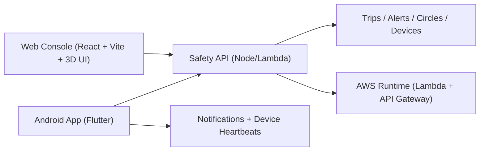

# Safety Copilot

Cloud-first personal safety platform with:
- trusted-circle coordination,
- trip-based live monitoring,
- SOS and silent SOS escalation,
- cross-platform product surfaces (web + Android Flutter),
- AWS-hosted backend and live deployment path.

## Live endpoints

- Web app: `http://safety-copilot-ui-119944160349-20260410111252.s3-website.ap-south-1.amazonaws.com`
- Privacy policy: `http://safety-copilot-ui-119944160349-20260410111252.s3-website.ap-south-1.amazonaws.com/privacy-policy.html`
- API base: `https://6rpyxxaw7c.execute-api.ap-south-1.amazonaws.com/api/v1`
- Health: `https://6rpyxxaw7c.execute-api.ap-south-1.amazonaws.com/health`

## Product highlights

- Authentication and session bootstrap with resilient API failover strategy (mobile).
- Trusted circles and member onboarding for family/guardian visibility.
- Live trip orchestration with destination and telemetry stream.
- SOS + silent SOS escalation flows.
- Alert feed with acknowledgment workflow.
- Advanced visual UX:
  - animated 3D-like safety core,
  - route globe visualization,
  - threat radar sweep,
  - cinematic SOS impact overlays.

## Architecture at a glance



## Repository map

- `docs/`: teaching flow, AWS architecture, deployment guides, Play Store and policy docs.
- `real-version/backend`: Node.js safety backend, routes, controllers, services, infra scripts.
- `real-version/frontend`: operator-grade web console with animation and 3D safety UI.
- `real-version/mobile/safety_copilot`: Flutter Android app with production flavor setup.

## Local development

### Backend

```bash
cd real-version/backend
npm install
npm run start
```

Runs at `http://localhost:4002`.

### Frontend

```bash
cd real-version/frontend
npm install
npm run dev
```

Runs at `http://localhost:5173`.

### Flutter mobile

```bash
cd real-version/mobile/safety_copilot
flutter pub get
flutter run --flavor dev --dart-define=FLAVOR=dev --dart-define=API_BASE_URL=https://6rpyxxaw7c.execute-api.ap-south-1.amazonaws.com/api/v1
```

## Release assets

- Latest APK:
  - `real-version/mobile/safety_copilot/releases/android/v1.0.0+1/safety-copilot-v1.0.0+1-prod-release.apk`
- SHA256:
  - `83B1FEFE5344F23236647259458DA827D75193ABA4814C09B0890DE89083C9B7`

## Documentation entry points

- Complete module flow: `docs/full-modules-guide.md`
- Cloud + AI architecture: `docs/aws-ai-architecture.md`
- Mobile module track: `docs/mobile-teaching-modules.md`
- Live AWS deployment notes: `docs/aws-live-deployment.md`

## Current production note

Backend is live and functional for demo/prototype use.
For long-term production durability, migrate persistence fully to DynamoDB (see backend infra docs).
