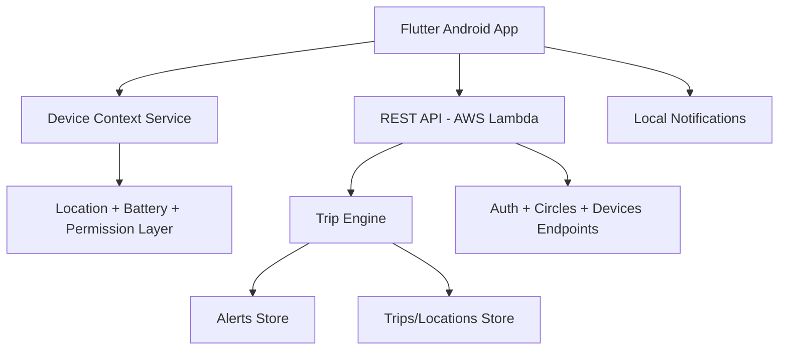

# 02 - Architecture

## Mobile
- Flutter app with `dev` and `prod` flavors
- State management via Provider
- Core modules: Auth, Circles, Trip, Alerts, SOS, Device heartbeat

## Backend
- Node.js API on Lambda
- Endpoints:
  - `/auth/*`
  - `/circles/*`
  - `/trips/*`
  - `/alerts/my`, `/alerts/:id/ack`
  - `/devices/register`, `/devices/heartbeat`, `/devices/my`

## Cloud
- API hosted via Lambda URL
- Frontend hosted on S3 static website
- Deployment artifacts in S3 bucket
- Planned durable migration: DynamoDB-backed runtime store
